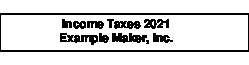

- [Introduction](#org5321c5a)
- [Usage](#orgd4f34bb)
  - [Motivation](#org5afb8f1)
  - [Quick Start](#orgd2aaa4e)
  - [Editor Integration](#org0d0ab32)
    - [Emacs](#org329ea8b)
    - [Vim](#org0ee2ebb)
    - [Installing the Libraries](#orge148ef7)
  - [A Tip on Buying File Folder Labels](#org3affc1b)
  - [Installation](#orgf346a6c)
  - [Setting options](#org0303e2b)
  - [Dimensions and other values in options](#orgac02fec)
  - [Page Setup Options](#org8d87af3)
    - [Orientation](#orgebf3088)
    - [Page Dimensions](#org3747042)
    - [Page Grid](#orgbf9835d)
  - [Label Setup Options](#org222ae79)
    - [Padding](#org1ac5a7a)
    - [Alignment](#orgae6d676)
    - [Fonts and styling](#orge168979)
    - [Position Adjustment](#org7864e64)
  - [Job Processing Options](#orgb16acf4)
    - [Starting label](#orge122522)
    - [New line marker](#org4d0599a)
    - [Label separator](#org81642dc)
    - [Number of copies](#org9645a37)
    - [Input and output files](#org172e7f2)
    - [Printing or viewing](#org238064b)
    - [Printing and viewing shell commands](#org7229af0)
    - [Aids to testing label layouts](#org825e372)
  - [The Label Database and the label option](#orge59320b)
    - [Listing labels](#org52f3c01)
    - [System label database](#org6184061)
    - [Trying out a label definition](#org7159619)
    - [Nesting label definitions](#org1306774)
    - [Label database entries as configuration sets](#org24ef6fc)
    - [A Caution about option order](#org9d920e2)
- [Development](#org586833f)
- [Contributing](#orgecdf77a)

[](https://github.com/ddoherty03/labrat/actions/workflows/main.yml)


<a id="org5321c5a"></a>

# Introduction

This gem provides a command-line application, `labrat`, for the easy printing of labels after suitable configuration. It also provides Emacs and `vim` libraries for easily invoking `labrat` from within the editor to make a label from the paragraph at point.

It can handle everything from label printers such as the Dymo LabelWriter geared toward single label printing to full-size printers for printing a series of labels on label sheets from Avery or other suppliers of label sheets. It includes a library of pre-configured settings for around 250 label products, and provides a convenient way to define new ones or variations on the pre-configured ones.

It also provides aids to configuring new labels such as printing page grids based on label definitions to refine new label definitions.

Easy-to-print labels can make the process of creating file folders trivial, but there are many other uses for them, such as badges and marking cables, electrical panels, ports, and outlets.

Buy your copy today while supplies last!


<a id="orgd4f34bb"></a>

# Usage

`labrat` is a linux command-line program for quickly printing labels. It uses the [Prawn gem](https://github.com/prawnpdf/prawn) to generate PDF files with label formatting in mind. With `labrat` properly configured, printing a label is as simple as:

```
$ labrat 'Income Taxes 2021 ~~ Example Maker, Inc.'
```

And you will get a two-line file-folder label printed that looks like this:



Note that an outline was added to make the size of the label apparent and is not actually printed with the label by default.


<a id="org5afb8f1"></a>

## Motivation

I need to print labels. And in my case, mostly I need file folder labels. I typically want to print to a Dymo LabelWriter, of which I own several variants. The problem is that I work almost entirely in Linux, but the simple task of printing a file folder label has required opening a GUI application, such as the very fine [glabels](https://help.gnome.org/users/glabels/stable/), or worse, switching to a machine running Windows or to a Mac to run Dymo's proprietary GUI. The Dymo GUI is particularly irksome because it takes a long time to start up and demands that you register every time you open it.


<a id="orgd2aaa4e"></a>

## Quick Start

That's too much ceremony for generating simple labels. I wanted a way to print a file label from the command line, or even better, from within my editor, Emacs. After giving up looking for such a thing without success, I decided to write my own. Hence labrat. With it&#x2014;after due configuration&#x2014;printing a file folder label is as simple as:

```sh
$ labrat 'First Line of Label ~~ And the Second Line'
```

Or, you can preview the label in your previewer of choice (mine is qpdfview) by adding the -V flag:

```sh
$ labrat -V 'First Line of Label ~~ And the Second Line'
```


<a id="org0d0ab32"></a>

## Editor Integration


<a id="org329ea8b"></a>

### Emacs

Even better, I have included with `labrat` an elisp file (`labrat.el`) that will invoke `labrat` to form a label with the text of the paragraph at or before point. So within Emacs, you can bind keys to the commands, `labrat-print` and `labrat-view` to print or view the current or prior paragraph as your default label. Thus, in Emacs, I have `C-z C-l C-l` bound to `labrat-print` and `C-z C-l C-v` to `labrat-view`, and I can type a label in any buffer and get it generated with very little ceremony.


<a id="org0ee2ebb"></a>

### Vim

There is also a vim plugin that you can copy to you `~.vim/plugins/labrat.vim` directory to invoke `labrat` from within `vim`. Suggested keybindings are included for copying to `~/.vim/after/plugin/labrat.vim` that bind `<leader>lp` and `<leader>lv` to invoke `labrat` in normal and visual modes.


<a id="orge148ef7"></a>

### Installing the Libraries

After running `labrat-install` both the emacs and vim libraries will be copied to `~/.config/labrat`. It's up to you to copy them from there to you Emacs load-path or vim `plugin` and `after/plugin` directories respectively.

Or, you can just add symlinks to the distributed files, so you get updates whenever you update `labrat`:

For emacs:

```sh
$ cd ~/.emacs.d/lisp  # Assuming this is on your load-path
$ ln -s ~/.config/labrat/labrat.el labrat.el
```

Then, \`require 'labrat'\` in you Emacs init file.

And for vim:

```sh
$ cd ~/.vim/plugin
$ ln -s ~/.config/labrat/vim/plugin/labrat.vim labrat.vim

$ cd ~/.vim/after/plugin
$ ln -s ~/.config/labrat/vim/after/plugin/labrat.vim labrat.vim
```


<a id="org3affc1b"></a>

## A Tip on Buying File Folder Labels

As mentioned, one of my main motivations for writing `labrat` was the need to easily create file-folder labels. I got into creating files after reading *Getting Things Done* by David Allen. One of his recommendations for keeping organized is having a filing system so that documents can be easily archived and retrieved.

I have long used Dymo's 30327 label, which is just the right size for file folders. But after several years of use, I started to notice something alarming: I could no longer read the text of the labels, they had nearly faded into oblivion. The problem is that the labels use a thermal printing technology that is affected by light and time, and over a period of years, they get lighter and lighter. You may have seen the same thing on old thermal-printed store receipts.

After looking for alternative printers, I found the solution, not in a new printer technology, but in a new label technology. DuraReady makes labels that can be printed on a thermal printer like the Dymo LabelWriter, but print on a "Gloss white polypropylene BOPP plastic." I'm not sure what that is, but the labels come out with nice black lettering on a white background, and they don't fade. Check it out here: [DuraReady](https://www.duraready.com/file-folder-labels/1034d-9/16-x-3-7/16-white-bopp-plastic-label/).

Thermal labels may be fine for ephemeral applications like name tags or shipping labels, but are terrible for long-term applications like file folders, marking cables, marking electrical breakers, or any other number of applications where long-term readability is essential.


<a id="orgf346a6c"></a>

## Installation

Since `labrat` is distributed as a Ruby gem, you have to have a ruby installation. Look [here](https://www.ruby-lang.org/en/documentation/installation/) for ruby installation instructions. You can then install `labrat` with:

```sh
$ gem install labrat
```

After installation, you should install the user and system (if you have sudo privileges) configuration files with:

```sh
$ labrat-install
```

This will, assuming you have sudo privileges, install an annotated system-wide config file in `/etc/xdg/labrat/config.yml` and a system-wide label database in `/etc/xdg/labrat/labeldb.yml`.

It will also install an annotated sample user config file in `~/.config/labrat/labrat.yml` and a sample user-level label database in `~/.config/labrat/labeldb.yml`.

For the benefit of Emacs users, it also installs the `labrat.el` elisp library in `~/.config/labrat` as well. You may want to add this directory to your `load-path` or copy, move, or link it to a directory already in your `load-path`.

If you invoke `labrat-install` multiple times, it will refuse to overwrite any existing config or database files that you may have already installed. If you want to re-install them you have to remove the existing files or move them out of the way.


<a id="org0303e2b"></a>

## Setting options

You can control how `labrat` composes a label completely from the command-line, though that would be a very tedious thing to have to do. Better, set up your preferred configuration in your user config file, so that all you need to supply on the command line is the text of the label. Every command-line option has an equivalent configuration option using the long form of the option as a key in a YAML configuration format.

Labrat reads options from the following locations, with the locations listed from lowest to highest priority. In other words, options set in the first-listed location can be overriden by settings in later-listed locations.

1.  From `/etc/xdg/labrat/config.yml`. This is a YAML formatted file in which the long form of the option, without the leading '&#x2013;', is used as a key with the setting as the value.
2.  From `~/.config/labrat/config.yml`. It also uses the YAML format based on the long form of option names.
3.  Finally, it reads options from the command-line, where, of course, the leading hyphens are mandatory.


<a id="orgac02fec"></a>

## Dimensions and other values in options

Many of the options deal with specifying some sort of distance. Those are designated with the placeholder `DIM`. A `DIM` is an integer or floating point number followed by an optional unit of measurement. If no unit is given, the unit `pt` for "points" are assumed. Here are the valid units that you can use:

-   **`pt`:** Points, or Adobe points, or "big points", equal to exactly 1/72 of an inch, the default if no unit is given
-   **`mm`:** Millimeters,
-   **`cm`:** Centimeters, equal to 10 millimeters,
-   **`dm`:** Decimeters, equal to 10 centimeters,
-   **`in`:** Inches,
-   **`ft`:** Feet, equal to 12 inches,
-   **`yd`:** Yard, equal to 3 feet.

Most other options are strings, which need to be quoted on the command-line if they contain any spaces or other characters special to your shell. In the configuration files, string values need not be quoted.


<a id="org8d87af3"></a>

## Page Setup Options

Labrat can handle multi-label pages such as Avery-style label sheets. These options deal with the page-level dimensions of the, potentially, multi-label page. By contrast, the dimensions of individual labels are dealt with by the label setup options described in the [next](#org222ae79) section.


<a id="orgebf3088"></a>

### Orientation

-   **`-L`, `--[no-]landscape`:** Orient the label grid and the printing direction of the text of the label in landscape (default false), i.e., with the label grid rotated 90 degrees counter-clockwise so that the first label is printed down the page starting at the upper right element of the grid. This setting does not affect what is left, right, top, or bottom for purposes of specifying the page dimensions, but does affect what is considered "horizontal rows" and "vertical columns": those are counted in the rotated direction of printing.
-   **`-P`, `--[no-]portrait`:** This is simply a convenience switch meaning `--no-landscape` and is the default.


<a id="org3747042"></a>

### Page Dimensions

When specifying page dimensions, `labrat` regards all dimension-related directions, left, right, top, bottom to refer to the page as is comes out of the printer, unaffected by whether the labels are printed in landscape or portrait. This hopefully eliminates some confusion in the use of those terms. Even a specialty label printer, such as the Dymo LabelWriter series, in which the long skinny labels come out of the printer sideways, regard the page dimensions in the orientation that the labels come out: that is, the "page" has a relatively narrow width compared to its tall height.

With that in mind, specifying the page dimensions is just a matter of getting out a ruler and measuring.

-   **`-w`, `--page-width=DIM`:** Horizontal dimension of a page of labels as it comes out of the printer
-   **`-h`, `--page-height=DIM`:** Vertical dimension of a page of labels as it comes out of the printer
-   **`--top-page-margin=DIM`:** Distance from top side of page (in portrait) to the print area
-   **`--bottom-page-margin=DIM`:** Distance from bottom side of page (in portrait) to the print area
-   **`--left-page-margin=DIM`:** Distance from left side of page (in portrait) to the print area
-   **`--right-page-margin=DIM`:** Distance from right side of page (in portrait) to the print area
-   **`--v-page-margin=DIM`:** Distance from top and bottom sides of page (in portrait) to the print area; short for `--top-page-margin` and `--bottom-page-margin`
-   **`--h-page-margin=DIM`:** Distance from left and right sides of page (in portrait) to the print area; short for `--left-page-margin` and `--right-page-margin`
-   **`--page-margin=DIM`:** Distance from all sides of page (in portrait) to the print area; short for `--top-page-margin`, `--bottom-page-margin`, `--left-page-margin` and `--right-page-margin`


<a id="orgbf9835d"></a>

### Page Grid

By default, `labrat` considers a page of labels to contain only one row and one column, that is, a single label per page. To set up a multi-label page, you have to describe the number of rows and columns and the amount of the gap between them. The number of "rows" is counted as the number of "horizontal" sets of labels after taking the page orientation into account. Likewise, the number of columns is counted as the number of "vertical" sets of labels after taking the page orientation into account

-   **`-R`, `--rows=NUM`:** The number of horizontal rows of labels on a page, taking into account the direction of printing via the `--landscape` switch.
-   **`-C`, `--columns=NUM`:** The number of vertical columns of labels on a page, taking into account the direction of printing via the `--landscape` switch.
-   **`--row-gap=DIM`:** The distance between rows of labels on a page
-   **`--column-gap=DIM`:** The distance between columns of labels on a page


<a id="org222ae79"></a>

## Label Setup Options

These options determine the layout of individual labels within the page grid rather than the page grid as a whole. Note that the dimensions of a single whole label is not specified, but is implicitly determined by:

1.  the page width and height,
2.  the page margins
3.  the number of rows and columns per page, and
4.  the row and column gaps.

The remaining space on the page is divided into a grid of identically-sized labels, which determines the size of each label.


<a id="org1ac5a7a"></a>

### Padding

Within each label, the following options allow you to set the margins on each side of the label:

-   **`--top-pad=DIM`:** Distance from top side of label to the printed text
-   **`--bottom-pad=DIM`:** Distance from bottom side of label to the printed text
-   **`--left-pad=DIM`:** Distance from left side of label to the printed text
-   **`--right-pad=DIM`:** Distance from right side of label to the printed text
-   **`--v-pad=DIM`:** Short for `--top-pad=DIM` and `--bottom-pad=DIM`
-   **`--h-pad=DIM`:** Short for `--left-pad=DIM` and `--right-pad=DIM`
-   **`--pad=DIM`:** Short for `--top-pad=DIM`, `--bottom-pad=DIM`, `--left-pad=DIM` and `--right-pad=DIM`


<a id="orgae6d676"></a>

### Alignment

By default the label text is centered horizontally and vertically within the label, but the following options allow you to alter that.

-   **`--h-align=[left|center|right|justify]`:** Horizontal alignment of text within the label (default center);
-   **`--v-align=[top|center|bottom]`:** Vertical alignment of text within the label (default center)


<a id="orge168979"></a>

### Fonts and styling

`labrat` provides a few simple means for styling the label text. Note that all of these apply to the whole label text: there is no provision yet for doing in-line changes of font styles.

-   **`--font-name=[Times|Courier|Helvetica]`:** Name of font to use. Currently, these are the only three fonts are available: Times, Courier, or Helvetica. Without this option, Helvetica is used;
-   **`--font-size=NUM`:** Size of font to use in points (default 12)
-   **`--font-style=[normal|bold|italic|bold-italic]`:** Style of font to use for text (default normal)


<a id="org7864e64"></a>

### Position Adjustment

Despite our best efforts, the vagaries of printer hardware, print drivers, and cosmic rays, sometimes the text of the label is not positioned correctly within the printable area of the label. These options allow you to nudge the print area a bit, left or right, up or down, to compensate for any such anomalies.

-   **`-x, --delta-x=DIM`:** Left-right adjustment (positive moves right, negative left) of label text within the label print area.
-   **`-y, --delta-y=DIM`:** Up-down adjustment (positive moves up, negative down) of label text within the label print area.


<a id="orgb16acf4"></a>

## Job Processing Options

The following options control the processing of labels by `labrat`.


<a id="orge122522"></a>

### Starting label

When printing onto a multi-label page, some of the labels may have already been used. In that case, the `--start-label` option allows you to tell `labrat` to start printing at some later label on the first page. This option has no impact on pages after the first. The label positions are numbered from 1 up to the number of labels per page (i.e., rows times columns) from left to right and down the page. If you want to print a sheet that shows the label numbers, see the `-T` template option below.

-   **`-S NUM`, `--start-label=NUM`:** Start printing at label number NUM (starting at 1, left-to-right, top-to-bottom) within first page only. Later pages always start at label 1.

This only affects the placement of the first label on the first page. Any later pages always start on the first label position.


<a id="org4d0599a"></a>

### New line marker

You can embed a special text-sequence in the label text to indicate where a line-break should occur. By default it is the sequence `∼∼`. This means that `labrat` will translate all occurrences of `∼∼` in the text into a line-break, even consecutive occurrences. There is no way to escape this in the text, so if you want labels that use `∼∼` as part of the text, you are going to have difficulty printing. But you can change the marker to something else with `--nlsep`. This is especially helpful when you are using the command-line to supply the label text since specifying line-breaks on a shell command can be difficult. However note that this substitution takes place even when reading label texts from a file or standard input.

-   **`-n`, `--nlsep=SEPARATOR`:** Specify text to be translated into a line-break (default ' `∼∼` ')


<a id="org81642dc"></a>

### Label separator

The only way to print more than one label from the command-line is to indicate where one label ends and the next begins with a special marker in the command-line arguments, by default the string '@@'. The text used for this can be customized with this option.

-   **`--label-sep=SEPARATOR`:** Specify text that indicates the start of a new label (default '@@')


<a id="org9645a37"></a>

### Number of copies

This option causes `labrat` to generate multiple copies of each label with all the copies printed sequentially on the page.

-   **`-c NUM`, `--copies=NUM`:** Number of copies of each label to generate.


<a id="org172e7f2"></a>

### Input and output files

1.  Output file

    By default, `labrat` generates all the labels into a PDF file located in the directory $XDG\_DATA\_HOME/labrat, which is `~/.local/share/labrat~` by default. The file's base name is time-stamped based on the time of the run. So, the file name might look like `~/.local/share/labrat/2025-12-26T04:23:32.324.pdf`. `Labrat` will never delete these files, so you might want to perform cleanup on this directory if disk space is precious.
    
    You can specify a different output file with the `--out-file` option.
    
    -   **`-o`, `--out-file=FILENAME`:** Put generated label in the given file
    
    Unless the `FILENAME` includes a directory, the file will be placed in the current directory. If you specify a directory that you do not have write permission on, `labrat` will raise an error and exit.

2.  Command-line arguments

    By default, `labrat` gets the text of the label from the non-option arguments on the command-line. It combines all the non-option arguments and joins them with a space between each argument. For example,
    
    ```
    $ labrat -c3 This is a 'single label' ' ~~ composed of all this' text --font-style=italic
    ```
    
    prints three copies of a single label in italics with two lines, breaking at the ' ~~ ' marker, resulting in something like this:
    
    ```
    This is a single label
    composed of all this text
    ```
    
    Note that when the label text is specified on the command-line, `labrat` just prints a single label. The only ways to get multiple labels is by (1) marking a separation between labels with the `--label-sep` marker ('@@' by default) or (2) using the `-c` (`--copies`) argument to get multiple copies of the label text. These options can be combined as well. For example,
    
    ```
    $ labrat -c3 This is the 'first label' @@ 'And the rest  ~~  is the second' text --font-style=italic
    ```
    
    will produce three copies of two separate labels:
    
    ```
    This is a the first label
    
    This is a the first label
    
    This is a the first label
    
    And the rest
    is the second
    
    And the rest
    is the second
    
    And the rest
    is the second
    ```

3.  Specified input file

    Rather than get the text from the non-option arguments on the command line, you can use the `--in-file` option to specify that label texts are to be read from the given file instead.
    
    Each paragraph in the file constitutes a separate label. Line breaks within the paragraphs are respected, though the `--nlsep` marker is still replaced with additional line breaks. Any line starting with a `#` character is considered a comment and is not included in the text of any label.
    
    -   **`-f`, `--in-file=FILENAME`:** Read labels from given file instead of command-line

4.  Standard input

    Only if there are no non-option arguments and no `in-file` specified, `labrat` acts as a filter and reads the label texts from standard input in same manner as for a specified `in-file`, treating each paragraph as a label text and disregarding comments.

5.  Template exception

    Notwithstanding all of the above, if the `-T` (`--template`) option is given (see below at [2.10.8](#org825e372)), all label texts from the command-line, an `in-file`, or standard input are ignored and a template is generated.


<a id="org238064b"></a>

### Printing or viewing

By default, `labrat` prints the generated output file to the printer named with the `--printer` option using the shell command specified in the `--print-command` option. But with the `--view` option, it will use the shell command from `--view-command` to view the generated PDF file instead.

-   **`-V`, `--[no-]view`:** View rather than print


<a id="org7229af0"></a>

### Printing and viewing shell commands

By default, `labrat` uses the shell command:

```
lpr -P %p %o
```

to print, and substitutes '%p' with the printer name and '%o' with the output file name. But you can specify a different print command with the `--print-command` option. The printer name used in the substitution is by default taken from the environment variable `LABRAT_PRINTER` if it is defined, or from the environment variable `PRINTER` if it is defined and `LABRAT_PRINTER` is not defined. If neither is defined, it defaults to the name 'dymo'. But you can set the printer name with the `--printer` option in any event.

-   **`-p`, `--printer=NAME`:** Name of the label printer to print on
-   **`-%`, `--print-command=PRINTCMD`:** Command to use for printing with %p for printer name; %o for label file name (the \`%\` is meant to remind you of a piece of a paper beingg fed between two rollers)

Likewise, `labrat` uses the shell command

```
qpdfview --unique --instance labrat %o'
```

to launch the previewer when the `--view` or `-V` options are given. It also '%o' with the output file name, but does not recognize '%p' as special. It is very likely that you will want to configure this with the `--view-command` option to your liking.

-   **`-:`, `--view-command=VIEWCMD`:** Command to use for viewing with %o for label file name (the \`:\` is meant to remind you of a pair of eyes looking at the purdy label)


<a id="org825e372"></a>

### Aids to testing label layouts

1.  Page Grid

    The following options are very useful if your are trying to configure the set up for a new label type or otherwise trying to figure out a problem, such as setting the `--delta-x` or `--delta-y` values for your setup.
    
    Normally, `labrat` does not print an outline for the labels, but if you are testing things out on plain paper, it helps to know where `labrat` thinks the boundaries of the labels are. The `--grid` or `-g` options provide this.
    
    -   **`-g`, `--[no-]grid`:** Add grid lines to output

2.  Page Template

    When trying to define a new label layout, it also helps to just see what a single sheet of labels would look like. That is what the `--template` (or `-T`) option gives you: it just prints an outline of where labels would be printed and numbers the labels, but it ignores any label text.
    
    -   **`-T`, `--[no-]template`:** Print a template of a page of labels and ignore any content

3.  Verbose Reporting

    Finally, `labrat` will print a lot of information about what it's doing with the `--verbose` or `-v` option. The information is printed to the standard error output stream. This is particularly helpful in determining how the final configuration was constructed from the various config files.
    
    -   **`-v`, `--[no-]verbose`:** Run verbosely, that is, print out lots of information about what `labrat` is doing as it processes the job.


<a id="orge59320b"></a>

## The Label Database and the label option

One of the nice things about `labrat` is that it comes with a database of pre-defined label configurations for many standard labels, especially Avery labels since they were good enough to publish PDF templates for all their products at <https://www.avery.com/templates>.


<a id="org52f3c01"></a>

### Listing labels

You can get `labrat` to list all the labels it knows about with

```
$ labrat --list-labels
```

Any users who create useful label definitions can propose them for inclusion with `labrat's` distributed label database by filing a pull request at this git repository.


<a id="org6184061"></a>

### System label database

Here for example is the definition for Avery 8987 labels from the system database:

```
avery8987:
  page-width: 8.5in
  page-height: 11in
  rows: 10
  columns: 3
  top-page-margin: 15mm
  bottom-page-margin: 16mm
  left-page-margin: 10mm
  right-page-margin: 10mm
  row-gap: 6.3mm
  column-gap: 13mm
  landscape: false
```

Note that it restricts itself to page-level settings. It would be inappropriate to, for example, include something like `font-style` in a system-wide label definition, though such things can be useful in a user's private label configuration.


<a id="org7159619"></a>

### Trying out a label definition

You can see the result of this definition by using `labrat's` `--template` and `--view` options, like this:

```
$ labrat -T -V --label=avery8987
```

And if you want to see it with sample label text filled in, try the following:

```
$ labrat -V -c30 --label=avery8987 'Four score and seven years ago ~~ Our fathers brought forth'
```


<a id="org1306774"></a>

### Nesting label definitions

As it happens, Avery 8986 is laid out identically to Avery 8987, and the label database makes an alias for it like this:

```
avery8986:
  label: avery8987
```

In other words, it defines the `avery8986` label with a nested `--label` option that simply incorporates the `avery8987` entry settings.


<a id="org24ef6fc"></a>

### Label database entries as configuration sets

This ability to use a label database definition as an alias for a whole set of other configuration options allows you to add entries to your user-level label database to collect useful sets of configuration settings under a name of your choosing. Here for example, are entries from my user-level database at `~/.config/labrat/labeldb.yml` file that define the configuration for file folders and badges:

```
ff:
  label: duraready1034D
  font-style: bold
  font-size: 12pt
  delta-x: -3mm
  delta-y: 0.5mm

badge:
  label: avery18662
  font-style: bold
  font-size: 18pt
```

With this, you can print a file folder label with:

```
$ labrat --label=ff 'Four score and seven years ago ~~ Our fathers brought forth'
```

And, if you want this to be your default label type, you can add to your user-level config file, an entry like this:

```
label:
  ff
```

Now you can print the label without the `--label` option on the command-line:

```
$ labrat 'Four score and seven years ago ~~ Our fathers brought forth'
```

If you want to print badges, you have to specify the `--label` option explicitly on the command-line:

```
$ labrat -V -c14 --label=badge 'Daniel E. Doherty ~~ (Amateur Programmer)'
```


<a id="org9d920e2"></a>

### A Caution about option order

Note that `labrat` processes options from the system config file, the user config file, and the command-line strictly in order so that later settings override earlier settings. For example, given the configuration above, where `ff` is your default label type, the following will not do what you expect:

```
$ labrat --font-style=italic --label=ff 'Four score and seven years ago ~~ Our fathers brought forth'
```

You expect the label to be printed in italic, but the `--label=ff` option in effect inserts all the settings for label type `ff` at that point in the command-line, and thus overrides the `--font-style` setting with its own, namely `--font-style=bold` from the user-level label database.

To get this to work, you have to put the command-line setting after the `--label=ff` option in order for it to take effect:

```
$ labrat --label=ff --font-style=italic 'Four score and seven years ago ~~ Our fathers brought forth'
```


<a id="org586833f"></a>

# Development

After checking out the repo, run \`bin/setup\` to install dependencies. Then, run \`rake spec\` to run the tests. You can also run \`bin/console\` for an interactive prompt that will allow you to experiment.

To install this gem onto your local machine, run \`bundle exec rake install\`.


<a id="orgecdf77a"></a>

# Contributing

Bug reports and pull requests are welcome on GitHub at <https://github.com/ddoherty03/labrat>.
